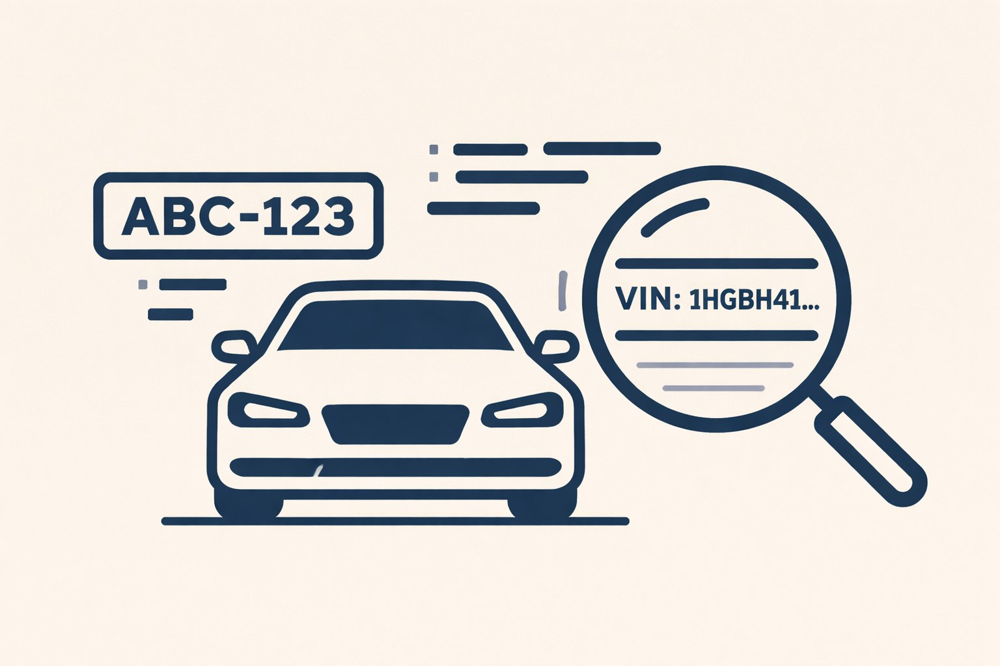

# osint_avto_probiv
Как проверить автомобиль по госномеру и VIN с помощью OSINT и Telegram-ботов: история авто, ДТП, объявления, пробег и открытые базы данных.

# 🚘 OSINT-проверка автомобиля по госномеру и VIN

Проверка автомобиля — это не только отчёт из официального сервиса.  
Даже обычный **госномер или VIN** оставляет за машиной десятки цифровых следов: объявления, фото, архивы продаж, сервисные базы и утечки.

OSINT по автомобилю — это способ собрать **всю доступную в открытых источниках информацию** и увидеть реальную историю ТС, а не только то, что показывает продавец.

---

## 🧭 Когда нужна OSINT-проверка авто

OSINT-анализ автомобиля используют, когда нужно:

- 🚗 проверить машину перед покупкой;
- 🔁 найти старые объявления о продаже;
- 📉 выявить скрученный пробег;
- 💥 обнаружить скрытые ДТП;
- 🧾 понять, сколько раз авто перепродавали;
- 📸 сравнить фотографии из разных источников;
- 📞 найти телефоны, связанные с объявлениями.

Во многих случаях именно **OSINT дополняет официальные проверки** и показывает то, что обычно не афишируется.

---

## 🔑 Госномер vs VIN — что даёт больше информации

**Госномер**:
- объявления на маркетплейсах;
- фото в соцсетях и форумах;
- связи с телефонами продавцов;
- история перепродаж.

**VIN-код**:
- заводская комплектация;
- участие в ДТП;
- сервисная история;
- пробег по годам;
- архивные базы.

📌 Если есть VIN — используй его всегда.  
Он даёт **в разы больше данных**, чем один только номер.

---

## 🤖 Telegram-боты для OSINT по автомобилю

Ниже — инструменты, которые используют для анализа авто, VIN и госномеров.  
Каждый из них работает с **разными источниками**, поэтому результаты могут отличаться.

### 🔍 OSINT-инструменты

[**Sherlock**](https://t.me/sherlocka_probiv_bot)  
Универсальный бот для поиска по госномеру и VIN.  
Подходит для первичной проверки: объявления, базовые совпадения, связи с другими идентификаторами.

[**Himera**](https://t.me/himera_sdsearch_bot)  
Расширенный OSINT-бот с доступом к большому количеству баз.  
Часто находит старые объявления, ДТП и данные, которых нет в стандартных сервисах.  
Минус — высокая цена запросов, но глубина анализа выше.

[**Duhless**](https://t.me/dyhlessa_probiv_bot)  
Один из самых «глубоких» ботов по архивам.  
Полезен для поиска старых VIN, истории продаж, утечек и связей автомобиля с телефонами и аккаунтами.

[**Enigma**](https://t.me/enigmasearchbots_probiv_bot)  
Инструмент для нестандартного OSINT-поиска.  
Может находить редкие упоминания авто в форумах, архивах и неочевидных источниках.

---

## 🧠 Как получать максимум информации

Чтобы OSINT по авто был эффективным:

- 🔁 проверяй **один и тот же VIN в нескольких ботах**;
- 🖼 сравнивай фото из разных источников;
- 🌐 ищи номер и VIN через Google и Яндекс;
- 🧩 смотри совпадения телефонов из объявлений;
- 🕰 обращай внимание на даты — расхождения часто указывают на скрытые проблемы.

OSINT — это **сбор пазла**, а не один отчёт.

---

## ⚠️ Важно понимать

OSINT по автомобилю:
- ❌ не является взломом;
- ❌ не даёт доступа к закрытым базам;
- ✅ работает только с открытыми и слитыми данными;
- ✅ используется для анализа и проверки.

Если данные существуют в интернете — OSINT помогает их **структурировать и связать**.

---

## ⚖️ Правовая информация

Вся информация на странице предоставлена **исключительно в ознакомительных целях**.

Допускается:
- проверка **собственного автомобиля**;
- анализ открытых данных;
- исследование публичных источников.

Запрещено:
- использовать данные для давления, шантажа или незаконных действий;
- распространять персональную информацию третьих лиц.

Автор проекта не несёт ответственности за использование материалов.

---

## 🏷 SEO и поисковые запросы

Материал посвящён OSINT-проверке автомобилей по госномеру и VIN.  
Рассматриваются методы анализа истории авто, поиска объявлений, выявления ДТП, проверки пробега и сопоставления данных из открытых источников.

**Ключевые фразы:**  
проверка автомобиля, пробив авто, пробить VIN, пробить авто по гос номеру, история автомобиля, OSINT авто, проверка машины перед покупкой, база ГИБДД, VIN проверка, госномер поиск, автомобиль OSINT, проверка ТС.

---

> 📌 Материал создан для повышения цифровой грамотности  
> и понимания того, какие данные об автомобиле доступны в открытом доступе.
